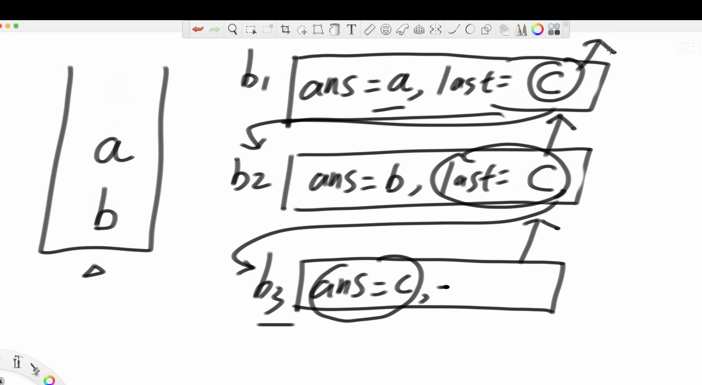
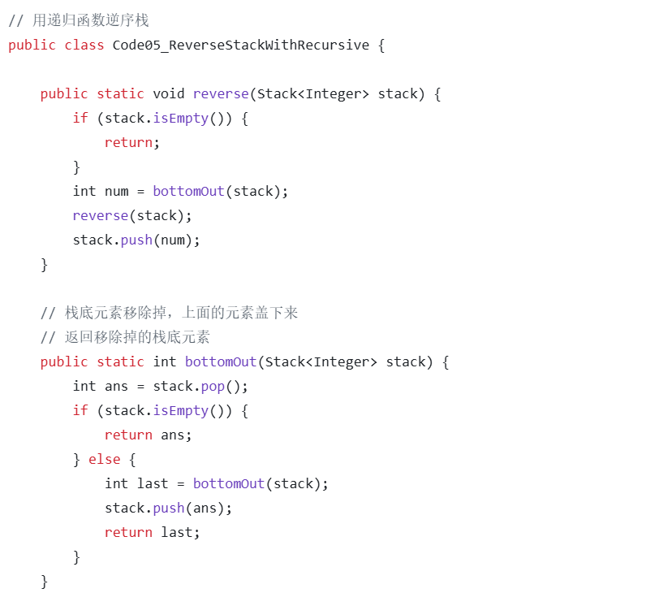

1.所有的递归行为都能用树形结构表示
2.对于字符串所有子序列的求解，首先需要一个全局path来记录这个这个路径，其次需要一个哈希set去重，因为可能会有比如说aab，则会出现俩个ab
3.对于返回数组的所有组合的求解，首先先对整个数组sort，然后把1分成一组2分成一组等等，讨论1要0个，1个······，然后再到2，依次来展开递归，其实这个也有用到剪枝的思想，就是比如说我的数组是11112···，如果是按照0位置的1要还是不要的话，展开到f(4)，需要2的四次方，但是想想，其实四个1也就五种组合，0,1,2,3,4，然后分别去调用f(4)，这样的话，就会省略掉很多不必要的过程，这个题目逻辑设计的本身就是一个剪枝的考虑，与题目一不同，题目一是每一个位置考虑要或者不要，这样自然就是一颗二叉树，即2的n次方，而这个题目最差的情况就是2的n次方，也就是没有相同的数字，即1234567···
4.对于递归，一定要清理现场，因为这次得到的状态，对下次得到的没有关系，必须回到原来的状态
5.对于生成元素不重复数组的全排列这个题目，首先就是每一个数字都能在一位置上，这个一个swap函数就可以解决，且整个递归过程是在原数组上进行的，一定要保证最后还要把i,j位置的数字还回去，也就是恢复现场，其次就是不要忘记每个数字自己和自己也可以进行交换，这个递归也很巧妙
6.若对于元素有重复的数组，只需要加一个去重逻辑即可，也就是说swap的时候，如果两个位置的元素相同的话就不用swap了，只需要加一个set去重即可
7.对于用递归函数逆序栈这个题目，，先写出bottomout函数，这个函数的作用就是把底部弹出，然后把上面的压下来就可以，然后再把这个函数用到图片中的reverse函数中就可以了